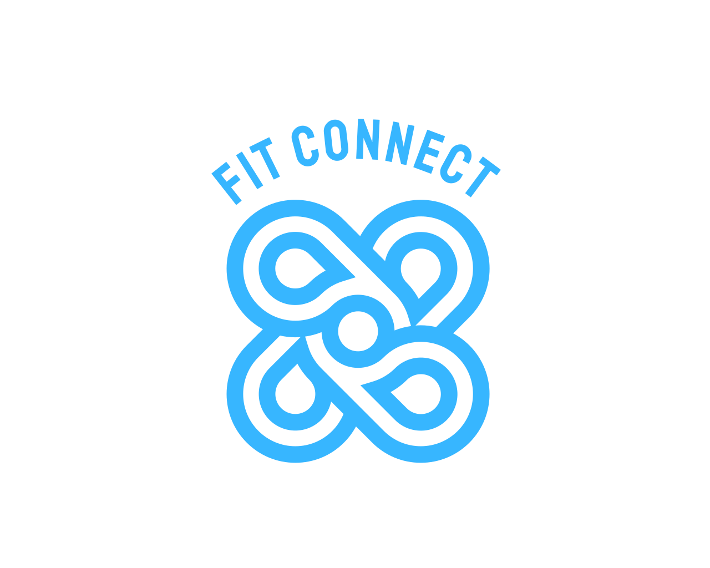
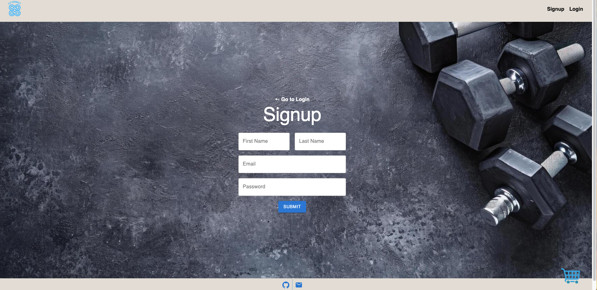
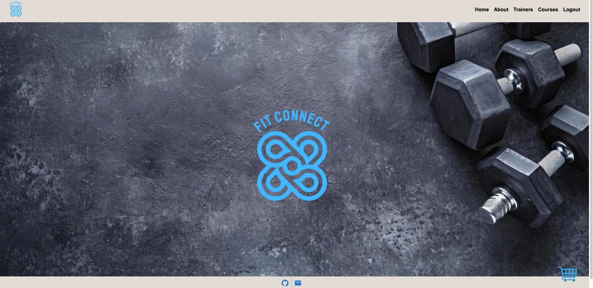
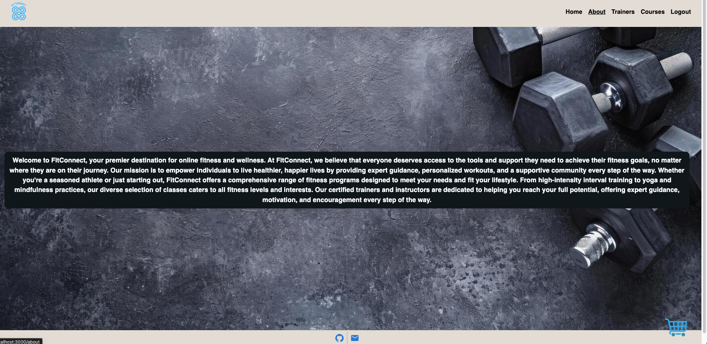
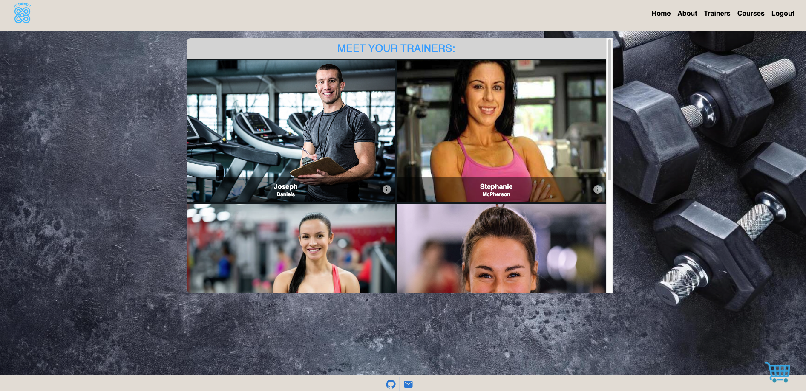
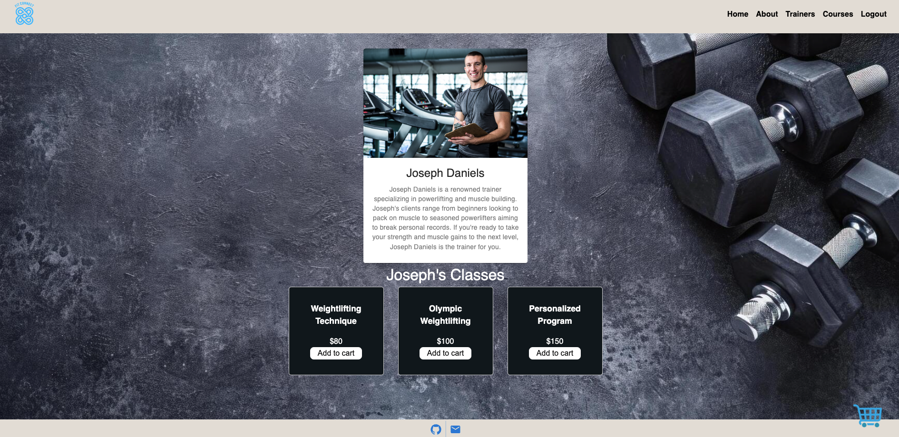
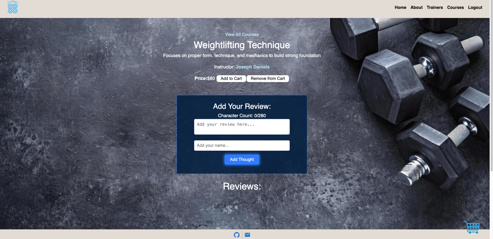
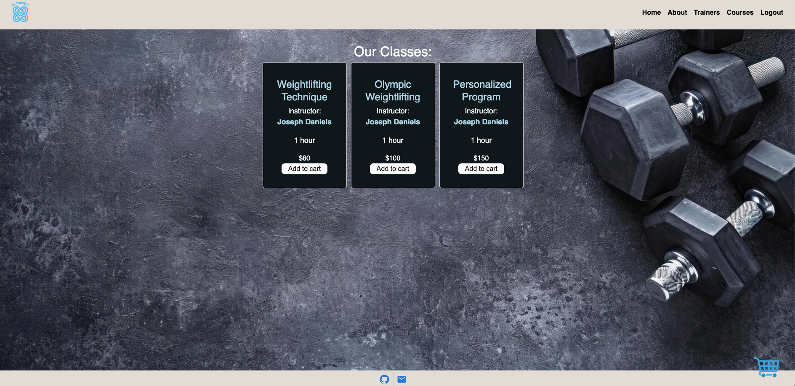
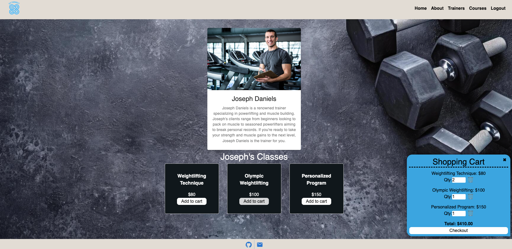

# Fit-Connect

<a name="readme-top"></a>

[![Contributors][contributors-shield]][contributors-url]

<br />
<div align="center">
<a href="https://github.com/cbursch13/Fit-Connect">

</a>

<h3 align="r">Fitness Connect</h3>
<p align="center">
    Check out the app here!
<br />

<br />
<a href="https://fit-connect.onrender.com">View App on Render</a>
    ·
<a href="https://github.com/cbursch13/Fit-Connect/issues">Report Bug</a>
    ·
<a href="https://github.com/cbursch13/Fit-Connect/issues">Request Feature</a>
  </p>
</div>

<details>
<summary>Table of Contents</summary>
<ol>
<li><a href="#overview-of-Fitness-Connect">Overview of Fitness Connect</a></li>
<li><a href="#user-story">User Story</a></li>
<li><a href="#acceptance-criteria">Acceptance Criteria</a></li>
<li><a href="#getting-started">Getting Started</a><li>
<ul>
<li><a href="#prerequisites">Prerequisites</a></li>
<li><a href="#installation">Installation</a></li>
</ul>
</li>
<li><a href="#technology-used">Technology Used</a></li>
<li><a href="#usage">Usage</a></li>
<li><a href="#links">Links</a></li>
<li><a href="#contributing">Contributing</a></li>
<li><a href="#license">License</a></li>
<li><a href="#contact-us">Contact Us </a></li>
<li><a href="#credits">Credits</a></li>
<li><a href="#acknowledgments">Acknowledgments</a></li>
</ol>
</details>

## Overview of Fitness Connect

The Interactive MERN SPA Project, also known as Fitness Connect, was designed to played a key role in our journey to becoming a full-stack web developer. This project was an opportunity to showcase our collaborative skills and coding abilities, especially in the context of a scalable, user-focused MERN app.

You'll learn more about the webpage below, but Fit Connect allows fitness enthusiasts to easily connect with like-minded individuals, find workout partners, and participate in group fitness sessions, ultimately enhancing their motivation, accountability, and enjoyment of their fitness journey.

## User Story

```
AS A fitness enthusiast,
I WANT TO use Fit Connect to find workout partners and join group fitness sessions, so I can stay motivated and committed to my fitness goals
SO THAT I can easily connect with like-minded individuals, find workout partners, and participate in group fitness sessions, ultimately enhancing my motivation, accountability, and enjoyment of my fitness journey.
```

## Acceptance Criteria

```
Use React for the front end.
Use GraphQL with a Node.js and Express.js server.
Use MongoDB and the Mongoose ODM for the database.
Use queries and mutations for retrieving, adding, updating, and deleting data.
Be deployed using Render (with data).
Have a polished UI.
Be responsive.
Be interactive (i.e., accept and respond to user input).
Include authentication (JWT).
Protect sensitive API key information on the server.
Have a clean repository that meets quality coding standards (file structure, naming conventions, best practices for class and id naming conventions, indentation, high-quality comments, and so on).
Have a high-quality README (with unique name, description, technologies used, screenshot, and link to deployed application).
```

<p align="right">(<a href="#readme-top">back to top</a>)</p>

## Technology Used

- 

- 

- 

- 

- 

- 

- 

- 

- 

## Getting Started

How to get started with the Fitness Connect!

### Prerequisites

- npm
- Render

### Installation

Instructions on how to download our app.

1. Visit our app on [Render](https://fit-connect.onrender.com)

OR

1. Visit us @ GitHub [Stephen Rossetti](https://github.com/stephenrossetti), [Cameron Bursch](https://github.com/cbursch13), [Logan Patrick](https://github.com/LogOfPat), and [Adam Boudraa](https://github.com/adamboudruh)
2. Clone the repo
   ```sh
   git@github.com:cbursch13/Fit-Connect.git
   ```
3. Install NPM packages

   ```sh
   npm i
   ```

4. To run, build, seed, or further install packages on our app choose between the following inputs defined in the package.json: develop, start, install, seed, and build

   ```sh
      npm run [INPUT]
   ```

5. Run and connect

   ```sh
   http://localhost:3000
   ```

<p align="right">(<a href="#readme-top">back to top</a>)</p>

## Usage










## Links
[The URL to Render](https://fit-connect.onrender.com)

[The URL of the Github Repository](https://github.com/cbursch13/Fit-Connect)

<p align="right">(<a href="#readme-top">back to top</a>)</p>

## Contributing

Here is how you can be apart of creating Fitness Connect.

1. Fork the Project
2. Create your Feature Branch (`git checkout -b [BRANCH NAME]`)
3. Commit your Changes (`git commit -m 'Add my commits to main'`)
4. Push to the Branch (`git push origin main`)
5. Open a Pull Request

<p align="right">(<a href="#readme-top">back to top</a>)</p>

## License

N/A

<p align="right">(<a href="#readme-top">back to top</a>)</p>

## Contact Us

Contact me ([Stephen Rossetti](https://github.com/stephenrossetti), [Cameron Bursch](https://github.com/cbursch13), [Logan Patrick](https://github.com/LogOfPat), and/or [Adam Boudraa](https://github.com/adamboudruh)) if you have any questions or feedback.

<p align="right">(<a href="#readme-top">back to top</a>)</p>

## Credits

Coding help from external sources:

- Utilized class UMN Bootcamp class activities for coding templates.
- Utilized TAs for debugging help.
- Utilized StackOverflow for utilities such as email regular expression.
- Utilized Material UI and previous projects for initial CSS.

<p align="right">(<a href="#readme-top">back to top</a>)</p>

## Acknowledgments

Thanks to our resources on creating our app!

- [Visual Studio Code](https://code.visualstudio.com/)
- [Render](https://render.com/)
- [Static Badges](https://shields.io/badges)

<p align="right">(<a href="#readme-top">back to top</a>)</p>

[contributors-shield]:https://img.shields.io/badge/CONTRIBUTORS%20--4?style=for-the-badge&logo=gitlab&labelColor=WHITE
[contributors-url]: https://github.com/cbursch13/Fit-Connect/graphs/contributors
